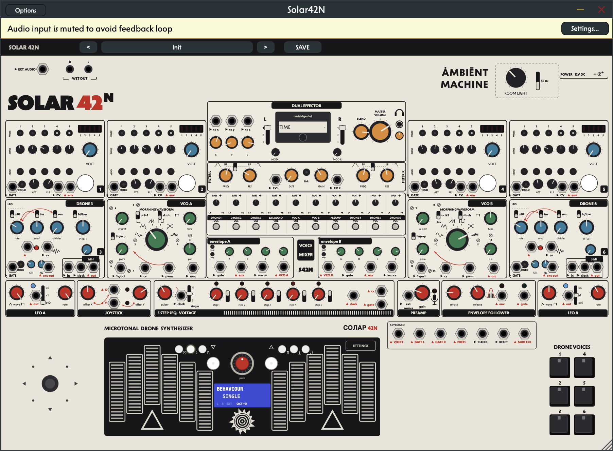
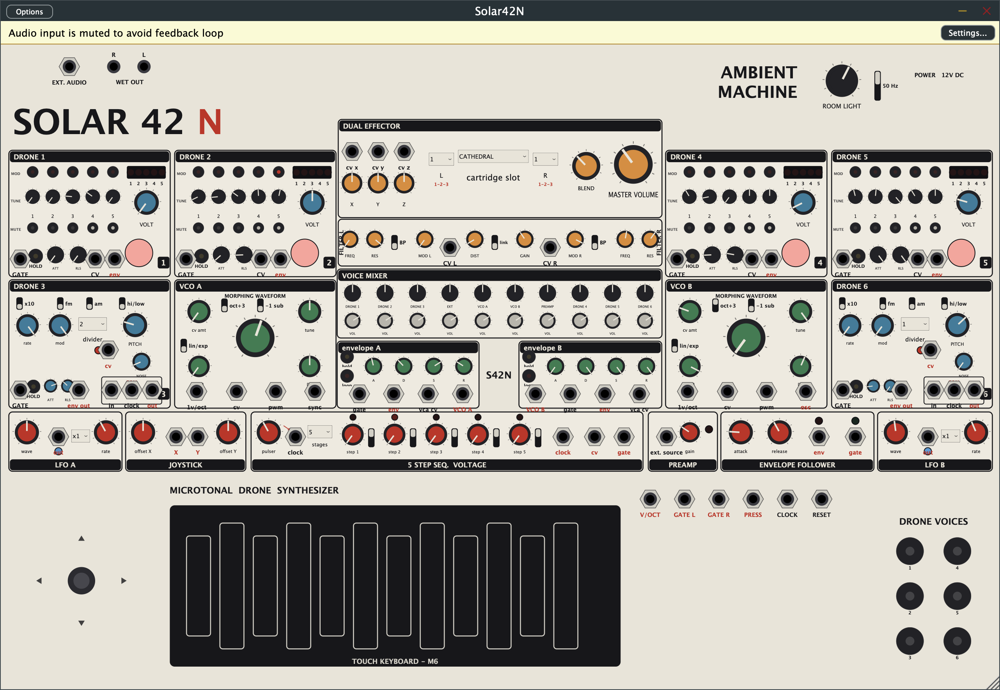
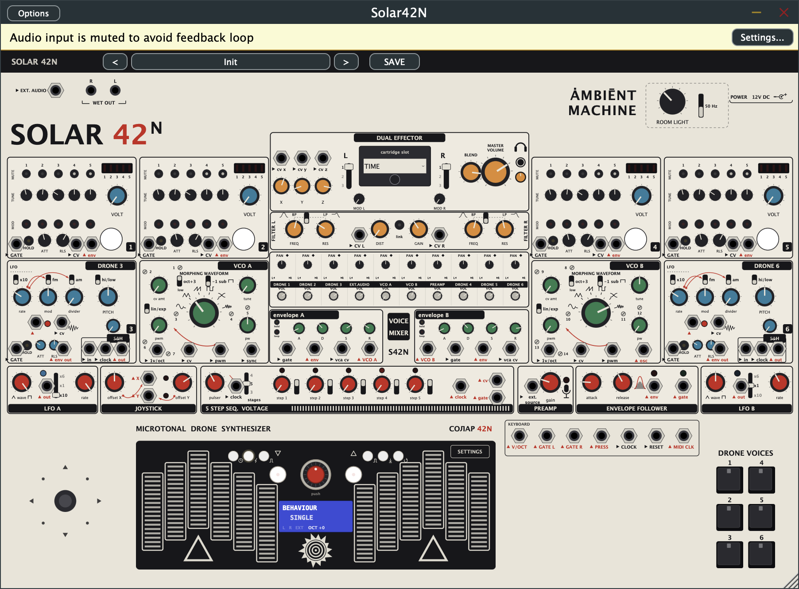

# Solar 42N — a digital instrument, built to learn how they work

A software recreation of the **[Elta Music Solar 42N](https://eltamusic.com/)** — a microtonal
ambient drone synthesizer — written from scratch in **C++ / JUCE 8** as a native
macOS app and plugin (Standalone + AU + VST3).

> **This is a personal learning project.** The goal is to understand how digital
> instruments actually work under the hood — oscillators, filters, virtual patch
> cables, fixed-point DSP chips, plugin state — by rebuilding a real piece of
> hardware, one subsystem at a time. It is not affiliated with or endorsed by
> Elta Music, and nothing here is distributed commercially.



*The full panel, drawn entirely in code (vector paths, no bitmaps): 8 sound
sources, dual filters, a 10-channel mixer, dual FV-1 effector, mod strip, and
the capacitive touch keyboard — every knob, switch, and jack is live.*

---

## What it does

The Solar 42N is a drone machine: 6 drone voices + 2 VCOs feed a mixer where
**panning doubles as filter routing**, into two Polivoks-style filters, then a
dual FV-1 effects chip with swappable cartridges (shimmer reverbs, delays,
reverse loopers). Everything can be rewired with patch cables.

This recreation models all of that:

- **Everything is voltage.** Every jack signal is a voltage at audio rate on a
  shared bus. Patch cables are real signal routing, not UI decoration — you can
  patch feedback loops and they saturate musically instead of exploding, just
  like the hardware.
- **Hardware normalling.** Unpatched jacks fall back to the same default
  connections the real unit has (keyboard → VCOs, noise → sample & hold, …),
  and patching a cable breaks the normal automatically.
- **8 sound sources.** Four "classic" drone voices (5 detuned saws each, with a
  VOLT knob whose upper half melts into cross-FM chaos), two *Papa Srapa*
  relaxation-oscillator voices, and two AS3340-style VCOs with morphing
  waveforms and hard sync.
- **A real FV-1 emulation.** The effects section runs a fixed-point virtual
  machine of the Spin FV-1 DSP chip at its native 32,768 Hz, executing
  SpinASM programs assembled at runtime — it can run community FV-1 binaries.
  The effect cartridges (CATHEDRAL, TIME, VIBROTREM, OCHRE) are original
  programs written for this project.
- **"Live stereo" tolerances.** Every paired component (filters, FV-1 clocks,
  oscillator tuning) gets small fixed offsets from a persisted per-instance
  "unit serial" — so left and right are never identical, the way two analog
  circuits never are.
- **Playable touch keyboard.** The 12-plate capacitive keyboard is emulated as
  firmware (pressure, glissando, a 19-scale microtonal quantiser, arpeggiator,
  step sequencer) with the real encoder-and-LCD menu — plus a modern settings
  drawer and full MIDI in (notes, pressure, CC learn, clock).

## Screenshots

**Where it started** — first full-panel milestone (M5), sections blocked out
and every jack patchable:



**Where it is now** — after a long legibility-and-fidelity pass against photos
of the real front panel: print-style section bands, jack I/O markers, silkscreen
glyphs, the rebuilt keyboard and drone keypad:



The geometry reference for all of it is the actual 42N front panel
(`reference-docs/solar42n-panel-1.png`).

## How the engine is put together

```
app/src/
├── dsp/      oscillators, filters, envelopes, tuning constants   (pure C++, no JUCE)
├── fv1/      Spin FV-1 virtual machine + SpinASM assembler       (pure C++, no JUCE)
├── engine/   the Rack: jack registry, routing, modules, keyboard (pure C++, no JUCE)
├── plugin/   JUCE processor glue
├── ui/       code-drawn panel, cable layer, telemetry LEDs
└── state/    presets, save/recall, tolerances
```

A few design decisions that made the project tractable:

- The three DSP layers are **JUCE-free static libraries**, so all of the sound
  engine is unit-testable headlessly (105 Catch2 tests, including per-opcode
  FV-1 goldens and randomized state round-trips).
- One **jack registry** (`engine/Jacks.h`) is the single source of truth for
  the engine, the UI, and saved state — adding a jack in one table lights it up
  everywhere.
- Modules process in **fixed hardware order** with 64-sample sub-blocks;
  a cable patched "backwards" reads the previous sub-block, which is exactly
  how feedback behaves on the real unit (~1.3 ms loop delay).
- Every value the manuals *don't* specify (envelope curves, LFO ranges, filter
  self-oscillation point…) lives as a named constant in one file,
  `dsp/TuningConstants.h`, and gets calibrated **by ear** against recordings of
  the hardware.

## Building

Requires macOS, CMake ≥ 3.25, and Xcode command-line tools. JUCE 8 and Catch2
are fetched automatically.

```sh
cd app
./scripts/check.sh   # configure + build + tests + pluginval + render smoke test
```

The standalone app lands in
`app/build/Solar42N_artefacts/RelWithDebInfo/Standalone/Solar42N.app`, and
`app/build/solar42n_render out.wav 20` renders audio headlessly.

## Repo map

| Path | What it is |
|---|---|
| `app/` | The buildable instrument (CMake + JUCE 8) |
| `07-42n-panel-inventory.md` | Hardware source of truth — every control, jack, normal, and voltage |
| `08-implementation-plan.md` | The plan of record + milestone status tracker |
| `00-LOG.md` | Chronological build log, including listening-test verdicts |
| `09-calibration-protocol.md` | The tune-by-ear protocol for `TuningConstants.h` |
| `reference-docs/` | Panel renders and manual digests used as references |
| `renders/` | Milestone audio renders and panel screenshots |
| `drone-lab/` | An early throwaway web prototype (kept for history, not extended) |

## Status

The core instrument is complete and passing its full gate (tests, pluginval
strictness 10, auval, ~4 % CPU): all voices, full patching, FV-1 effects,
keyboard, presets, MIDI in/out. Current work is **calibration by ear** —
listening sessions against the real hardware's demo recordings to tune the
constants the manuals never wrote down.

## Acknowledgements

- **Elta Music**, for designing an instrument weird enough to be worth
  understanding. Buy the real one — the hardware is the point.
- **Spin Semiconductor's** public FV-1 documentation, which made a faithful
  chip-level emulation possible.
